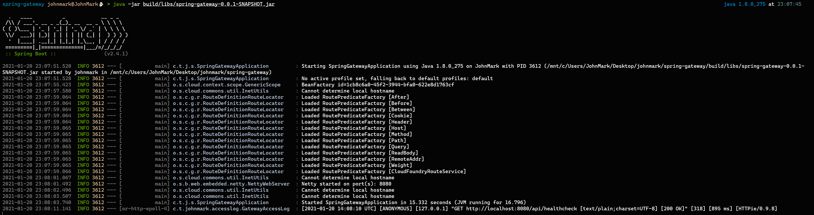

# spring-cloud-gateway-access-log-starter
Simple Spring Cloud Gateway Access Log starter


### Build
```shell
./gradlew clean build -x test
```


### Custom Access User Information Resolver

```java
public interface AccessUserInformationResolver {
	String resolveAccessUserInformation(ServerWebExchange serverWebExchange);
}
```

AccessUserInformationResolver is a class that helps you leave user or client information in the access log.
For example, if you want to leave session information for a user or client in all request logs, you can leave it through the AccessUserInformationResolver class.

### Example
- Implement the AccessUserInformationResolver interface and register it as a Spring Bean.
```java
	@Bean
	public AccessUserInformationResolver accessUserInformationResolver() {
		return serverWebExchange -> "ANONYMOUS";
	}
```

- Example Log Image

